# 02B장. 소프트웨어 공학으로 Wickle의 구조 읽기

이 장의 앞부분은 기초 엔진의 설계다. 마지막의 **0.2.0에서 추가로 분리한 책임**과 [변경 지도](changes-v0.2.md)를 함께 읽는다. 최종 동작의 기준은 0.2.0 태그다.

[목차](README.md) · [이전: 비동기 Rust](02-async.md) · [다음: 구현 시작](03-workspace.md)

이 장은 패턴 이름 암기보다 **변경 이유와 실패 경계**를 설명하는 강의다. 아래 분류는 0.1.0의 구현에 대한 분석이다. “개발자가 이 패턴을 의도했다”는 역사적 주장과 구별한다. 각 구현 장에서 같은 설명을 실제 함수·테스트와 다시 연결한다.

## 1. 먼저 품질 요구에서 구조를 도출하기

간단한 데모는 `loop { model(); tools(); }`로 만들 수 있다. 하지만 다음 요구를 동시에 만족하려면 루프 밖의 경계가 필요하다.

| 구체적 상황 | 필요한 성질 | Wickle의 구조 |
| --- | --- | --- |
| OpenAI 대신 다른 제공자를 사용 | 모델 교체가 도구 실행을 바꾸지 않아야 함 | ModelPort와 provider Adapter |
| 같은 요청이 두 번 도착 | 한 업무가 두 Run으로 중복 실행되지 않아야 함 | admission identity와 digest |
| 승인 대기 중 사용자가 다른 팀으로 이동 | 과거 허용을 영구 권한으로 쓰지 않아야 함 | 현재 PolicyGate 재검사 |
| DB 저장 응답을 잃음 | 성공 여부를 다시 읽을 수 있어야 함 | revision, immutable record, idempotent command |
| 외부 쓰기 직후 프로세스가 죽음 | 중복 쓰기를 피하고 불확실성을 보존해야 함 | effect ledger와 reconcile |
| 대화가 context window보다 커짐 | 원본·필수 제약을 잃지 않아야 함 | 별도 projection과 context revision |
| 관리 화면이 연결을 끊음 | 업무 실행이 화면 수명에 묶이지 않아야 함 | driver와 RunHandle 분리 |

이 표가 아키텍처의 평가 기준이다. 코드를 파일 여러 개로 나누었다는 사실만으로 좋은 아키텍처라고 판정하지 않는다. 위 시나리오를 실제로 만족하고 변경 비용을 줄여야 한다.

## 2. 정적 의존 방향

<figure class="book-diagram">

<figcaption>Rust crate의 정적 의존 방향. 좁은 화면에서는 도해를 좌우로 스크롤할 수 있습니다.</figcaption>
</figure>

[SVG 내려받기](diagrams/core-dependencies.svg) · [Mermaid 원본](diagrams/core-dependencies.mmd) · [편집용 Excalidraw](diagrams/core-dependencies.excalidraw)

화살표는 Rust dependency 방향이다. 실행 중에는 core가 주입받은 adapter의 메서드를 호출하지만, core Cargo.toml은 해당 concrete adapter를 의존하지 않는다. “호출 방향”과 “소스 의존 방향”이 다를 수 있다는 것이 의존성 역전의 핵심이다.

코어도 tokio·serde·jsonschema 등에 의존한다. 따라서 “외부 라이브러리가 전혀 없는 완전한 clean core”라고 말하면 부정확하다. 실제 경계는 provider SDK와 DB, 애플리케이션 정책을 엔진에서 분리하는 데 있다.

## 3. 실행의 흐름과 신뢰 경계

<figure class="book-diagram">

<figcaption>실행 흐름과 신뢰 경계. 좁은 화면에서는 도해를 좌우로 스크롤할 수 있습니다.</figcaption>
</figure>

[SVG 내려받기](diagrams/execution-flow.svg) · [Mermaid 원본](diagrams/execution-flow.mmd) · [편집용 Excalidraw](diagrams/execution-flow.excalidraw)

model text, user input, retrieved document는 도구 실행 권한이 아니다. 신뢰된 Host는 credential과 소유 scope를 제공하고 core는 규칙을 강제한다. Port 구현이 악성이라면 같은 프로세스에서 파일을 몰래 읽는 행동까지 Rust trait이 차단하지는 않는다. 신뢰할 수 없는 코드를 실행할 때 필요한 OS 격리는 Host가 맡는다.

## 4. Port/Adapter와 의존성 역전

**문제:** 엔진 안에 `if provider == ...`와 DB query를 계속 추가하면 제공자 변경이 승인·재개 코드까지 파급된다.

**구현:** ModelPort, StateStore, PolicyPort, ToolExecutor 등의 trait을 core가 정의한다. provider, SQLite, Host 정책은 그 trait을 구현한다. AgentBindings가 concrete 구현을 주입한다. [08장](08-model.md), [13장](13-sqlite.md), [25장](25-openai.md)의 구현을 비교한다.

**장점:** fake 구현으로 결정적인 실패를 만들 수 있고, 선택하지 않은 provider dependency를 core에서 제외한다. 새 연결을 만들 때 엔진 제어 흐름을 복제하지 않는다.

**비용:** trait/DTO/매핑 코드가 많고 동적 dispatch와 boxed future 비용이 생긴다. 모든 backend가 같은 의미를 제공하는지 conformance test가 필요하다.

**대안:** 단일 제공자만 사용하는 일회성 도구라면 직접 SDK를 호출하는 편이 짧다. 이미 여러 저장소와 제공자가 필요한 라이브러리에서는 경계의 이익이 커진다. 추상화를 만들었다는 이유로 장래 모든 기능을 trait에 미리 추가하지 않는다.

## 5. Facade와 Composition Root

Agent/create_agent/RunHandle은 엔진의 Facade다. Host는 많은 내부 객체 대신 start/resume/outcome/events/cancel로 제어한다. 조립 자체는 Host의 composition root, 즉 필요한 concrete 객체를 만드는 한 지점에 모인다.

AgentBindings가 큰 것은 책임을 명시적으로 드러내는 장점과 첫 사용의 부담이라는 단점이 있다. 전역 service locator로 감추면 호출 코드가 짧아지지만 실제 의존성과 scope가 숨는다. 0.1.0의 construction은 외부 연결을 열지 않는다. 어댑터를 열 권한과 lease가 생긴 실행 segment에서만 I/O 자원을 연다. [15장](15-agent.md), [19장](19-adapters.md).

## 6. Strategy와 Registry

ModelRouter, ContextStrategy, Verifier는 각각 선택·문맥 축소·검증 알고리즘을 교체하는 Strategy로 이해할 수 있다. 예를 들어 router만 바꾸어도 model budget 저장 규칙은 ModelExchange에 남는다.

Registry는 ID/version에서 등록된 구현을 찾는다. 순수 DI와 달리 runtime의 profile reference를 실제 객체에 연결하는 lookup이 필요하다. 정확한 키 전체를 검사하지 않으면 다른 credential이나 scope의 객체를 잘못 고를 수 있다. 문자열 registry는 확장에 유리하지만 오타가 compile time에 잡히지 않으므로 등록 검증이 중요하다.

Strategy가 제안한 결과도 그대로 믿지 않는다. ContextStrategy가 incomplete tool group을 고르면 core가 거절한다. 확장 가능성과 무제한 권한은 다르다. [14장](14-routing.md), [22장](22-compaction.md), [23장](23-verification.md).

## 7. 상태 기계와 Command

실행을 bool의 조합 대신 RunStatus/phase, ToolCallState, WaitTarget 등의 enum과 명시적 transition으로 표현한다. 이는 상태 기계다. 각 상태 객체가 virtual method로 모든 동작을 담당하는 전형적 GoF State 클래스 구조는 아니다. Rust enum과 driver의 match로 구현한 방식이다.

ResumeCommand와 도구 call은 행위의 의도를 데이터로 저장하는 Command다. 저장 가능한 명령에는 stable identity, exact target, revision이 필요하다. 명령을 재전송해도 중복 효과가 생기지 않게 acceptance를 기록한다.

<figure class="book-diagram">

<figcaption>실행 상태와 재개. 좁은 화면에서는 도해를 좌우로 스크롤할 수 있습니다.</figcaption>
</figure>

[SVG 내려받기](diagrams/run-state.svg) · [Mermaid 원본](diagrams/run-state.mmd) · [편집용 Excalidraw](diagrams/run-state.excalidraw)

그림은 강의용 단순화다. 정확한 variant와 전이는 run.rs와 resume/recovery 구현을 읽는다. Waiting은 terminal과 같지 않으며, terminal Run을 새 명령으로 되살릴 수 없다. 명령형 코드보다 상태 자료형이 많아지지만 crash와 중복 요청의 의미가 명시된다. [16장](16-tools.md), [17장](17-resume.md), [24장](24-recovery.md).

## 8. Repository, Unit of Work, CAS, fencing

StateStore는 단순 `save(run)`보다 강한 계약을 가진다. snapshot뿐 아니라 messages/records/events를 함께 검증하고 commit한다. 이 원자 변경 묶음이 Unit of Work에 가깝다. memory와 SQLite 구현이 동일 계약을 공유한다.

CAS는 “내가 읽은 revision이 아직 최신인가”를 검사하고 fencing은 “이전 실행 소유자가 늦게 쓸 수 없는가”를 검사한다. 예를 들어 A가 generation 4에서 멈추고 B가 5를 받았다면 A의 재등장은 거절해야 한다. mutex는 한 프로세스의 동시 접근을 조절하지만 이런 프로세스 간 계약을 대신하지 않는다.

checkpoint 전체 저장은 정확성 로직을 재사용하기 쉽고 성능은 기록 크기의 영향을 받는다. 정상화된 SQL 테이블, append-only log, 원격 transactional DB가 대안이지만 각자 새로운 일관성·운영 비용이 있다. [06장](06-state.md), [13장](13-sqlite.md), [35장](35-integration.md).

## 9. Observer, Interceptor, Factory, 수명 wrapper

| 역할 | 실제 위치 | 장점 | 주의할 비용 |
| --- | --- | --- | --- |
| Observer | AfterTool/AfterRun Hook | 확정 결과 관찰을 업무 처리와 분리 | crash 이후 callback exactly-once는 별도 문제 |
| Interceptor에 가까운 변환 | BeforeRun/BeforeModel/BeforeTool | 공통 전처리 확장 | 순서·출처·변환의 저장이 필요 |
| Factory | AdapterFactory::open | 실제 자원 생성 분리 | 부분 실패 시 rollback 정리 책임 |
| Decorator에 가까운 wrapper | segment에 묶인 export | scope/run/lifetime 검사를 감쌈 | 종료된 참조와 새 segment를 엄격히 구분 |
| RAII + 명시적 async close | 자원 무효화와 해제 | 소유권을 코드에 표현 | Drop만으로 비동기 해제 완료를 약속하지 못함 |

Hook을 일반 middleware처럼 무제한 request patch로 만들지 않는다. 현재 정책의 deny를 풀거나 모델 옵션·completion 규칙을 마음대로 바꾸지 못한다. [18장](18-hooks.md), [19장](19-adapters.md), [32장](32-mcp.md).

## 10. Snapshot, Projection, Compiler, 지연 로딩

PromptSnapshot/BoundToolInput/ContextBatch는 시간이 지나며 바뀌는 값을 특정 실행에 고정한다. 재현성은 좋아지지만 최신 상태와의 차이를 명시적으로 다뤄야 한다. 고정된 자료라도 현재 접근권은 다시 확인한다.

ContextProjection은 저장 표현을 외부 표현으로 명시적으로 변환한다. 보호 필드를 제외하는 allowlist가 핵심이다. SchemaCompiler는 선언된 전체 도구 계약에서 모델 소유 입력만 파생한다. Skill lazy loading과 Artifact 참조는 초기 context 비용을 줄이지만 로딩 권한·해시·보존을 관리해야 한다. [09–11장](09-schema.md), [20–22장](20-sources.md).

## 11. 비슷하지만 동일하지 않은 패턴

- **Event Sourcing:** 이벤트를 저장하지만 모든 현재 상태를 이벤트만으로 재구축하는 모델은 아니다. snapshot과 protected record가 권위 있는 데이터다.
- **CQRS:** 공개 view와 protected detail, projection을 나누지만 독립 read database를 갖춘 전체 CQRS 아키텍처라고 단정하지 않는다.
- **Saga:** 불확실한 원격 효과를 reconcile하지만 범용 보상 거래를 자동 생성하지 않는다.
- **Transactional Outbox:** 상태와 이벤트의 원자 저장 및 Host delivery journal이 비슷한 문제를 다룬다. 운영 queue/worker 서비스까지 제공하는 것은 아니다.
- **Exactly-once:** 중복 요청 수락과 이미 저장된 결과 재사용은 가능하다. 임의 외부 시스템의 효과를 네트워크 장애에도 무조건 한 번만 발생시키는 보장은 아니다.
- **Actor:** driver가 실행을 소유한다고 완전한 actor framework인 것은 아니다. mailbox 기반의 모든 상호작용이나 분산 supervision을 제공하지 않는다.

이 구별을 할 수 있어야 새 기술을 도입할 때 이름보다 실제 요구를 비교할 수 있다.

## 12. 아키텍처 평가 과제와 해설

1. 모델 호출 코드 안에서 SQLite를 직접 열면 어느 경계가 사라지는가?
2. “이미 승인했으니 resume에서 권한 검사를 빼자”는 최적화가 무엇을 깨뜨리는가?
3. 도구 실행을 `join_all`로 병렬화하는 변경이 왜 단순 성능 최적화가 아닌가?
4. ContextSource를 post-run 메모리 쓰기에도 쓰면 무엇이 잘못되는가?
5. 이 엔진을 작은 단일 사용자 CLI에 쓰면 어떤 복잡성을 과하게 지불하는가?

해설: 1은 저장 추상화와 독립 provider 테스트, 2는 권한 철회와 현재 주체 검증, 3은 호출 순서·승인 중단·unknown 효과 이후 dispatch·예산 경쟁, 4는 조회 retry/recovery가 외부 쓰기를 중복할 수 있다는 문제다. 5에서는 조립·저장·버전·정책 계약을 구현해야 하는 비용을 인정해야 한다. 좋은 설계는 모든 상황에 가장 짧은 설계가 아니라, 목표로 한 실패 시나리오와 변경을 감당하는 설계다.

## 13. 0.2.0에서 추가로 분리한 책임

<figure class="book-diagram">

<figcaption>0.2.0 실행 책임의 분리. 좁은 화면에서는 도해를 좌우로 스크롤할 수 있습니다.</figcaption>
</figure>

[SVG 내려받기](diagrams/prepared-execution.svg) · [Mermaid 원본](diagrams/prepared-execution.mmd) · [편집용 Excalidraw](diagrams/prepared-execution.excalidraw)

<figure class="book-diagram">

<figcaption>저장 근거를 읽는 조회 흐름. 좁은 화면에서는 도해를 좌우로 스크롤할 수 있습니다.</figcaption>
</figure>

[SVG 내려받기](diagrams/inspection-flow.svg) · [Mermaid 원본](diagrams/inspection-flow.mmd) · [편집용 Excalidraw](diagrams/inspection-flow.excalidraw)

| 경계·패턴 | 추가로 분리한 책임 | 장점 | 비용·주의 |
| --- | --- | --- | --- |
| Versioned codec | 원래 제출과 현재 해석 | 과거 identity 비교 보존 | 원문·encoder 버전 관리 |
| Compiler/Adapter | 원본 계약과 provider 표현 | 지원 subset 차이 흡수 | 추가 tokens·decode·원본 재검증 |
| Immutable prepared plan | 논리 입력과 physical attempt | retry/recovery 재현 | 보호 기록·provenance 검증 |
| Unit of Work | 명령·segment·lease의 동시 확정 | 절반 수락·이중 worker 방지 | custom store 계약 강화 |
| Strategy + 제한된 proposal | 앱 중단 정책과 core 상태 | 업무 상태 확장 | timeout·schema·안전 기본값 |
| Command/Query 분리 | 제어 명령과 저장 진단 | 조회가 실행·비용을 만들지 않음 | 저장하지 않은 근거는 알 수 없음 |
| Provenance graph | 원문·요약·관찰의 의존 | 권한 철회 우회 방지 | lineage 크기와 검증 비용 |

### Rust 소유권과 runtime 비용도 설계다

`async`를 합성하면 큰 Future가 caller poll frame에서 먼저 만들어질 수 있다. heap에 pin한다는 사실만으로 생성 순간의 stack 비용이 사라지지 않는다. 이 버전은 factory를 받는 `future::boxed`로 별도 frame에서 생성하는 경계를 사용한다. 이는 새 task를 spawn하거나 cancellation·저장 소유자를 바꾸는 기능이 아니다.

또한 await한 Future가 항상 Pending을 반환하는 것은 아니다. ready-only loop에서는 heartbeat/control이 실행 기회를 잃을 수 있어 boundary의 cooperative yield가 필요하다. 이를 해결하려고 lease TTL만 늘리면 실제 결함을 가릴 수 있다. [44장](44-argument-repair.md), [46장](46-prepared-step.md), [58장](58-recovery-audit.md)을 연결해서 공부한다.

### 무조건 붙이면 안 되는 패턴 이름

이력·이벤트가 많아졌어도 순수 Event Sourcing으로 바뀐 것은 아니다. 진단 view가 있어도 별도 분산 read database를 구축한 전체 CQRS는 아니다. Unknown/reconcile은 범용 Saga 보상 엔진이 아니며, immutable request와 command는 임의 외부 시스템의 exactly-once를 보장하지 않는다.
